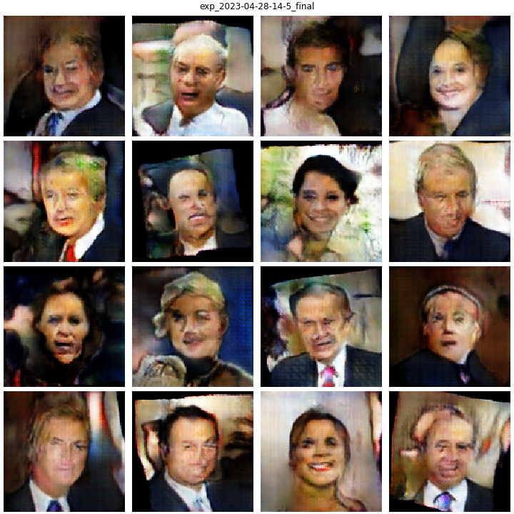

This is a sample project in area of Generative adversarial networks (GAN).
Libraries: `tensorflow`, `telegram_send`, `numpy`

**There are 3 tensorflow models in the project:**
- `generator` - creates images from random seed and try to trick discriminator
- `discriminator` - classifies input images as real or fake
- `GAN` is a sequential model of discriminator and generator, but with discriminator trainable flag set to False

**The training loop for the models:**
- `generate fake images` with generator
- `train discriminator` on real and fake images (50/50). Real images taken from [lfw_funneled](https://datasets.activeloop.ai/docs/ml/datasets/lfw-funneled-dataset/) dataset.
- `train GAN model` with random seed (latent points) as input. The discriminator model in GAN set as untrainable, so it calculates training loss and according it adjust generator model.

From iteration to iteration discriminator trains classify real images better and better, but generator trains to draw better images.

After 400 epochs it creates such images:

